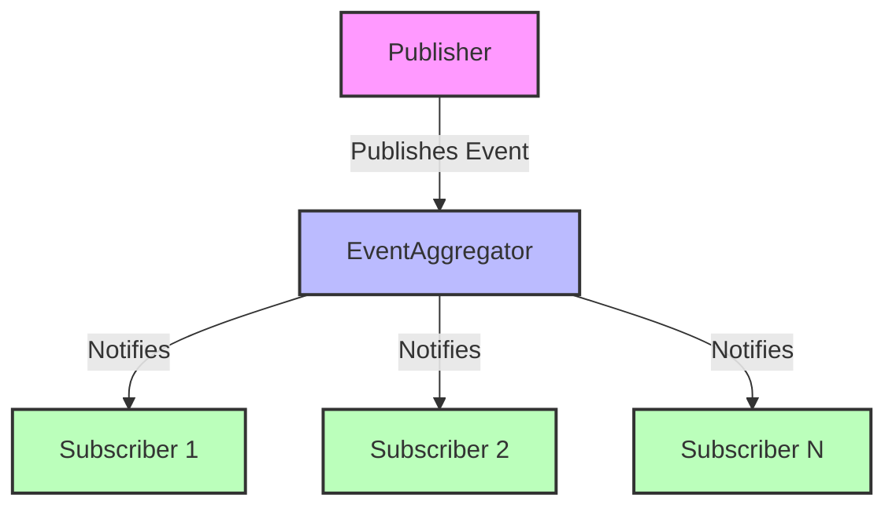
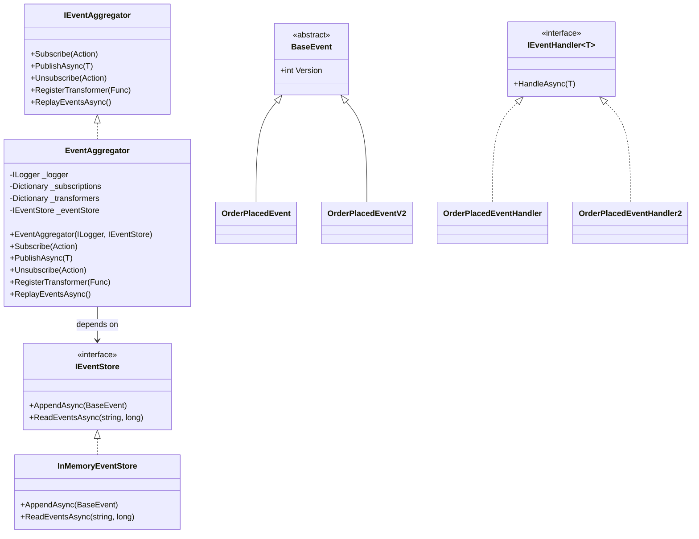

# Production-Ready Pub-Sub Pattern Implementation

This project demonstrates a production-ready implementation of the Publish-Subscribe (Pub-Sub) pattern in C#. The implementation includes features like thread safety, async support, dependency injection, logging, and error handling.

## Architecture

### High-Level Architecture


### Component Diagram


## Features

- **Thread Safety**: Thread-safe operations for concurrent subscriptions and publications
- **Async Support**: Full async/await support for event handling
- **Dependency Injection**: Integration with Microsoft.Extensions.DependencyInjection
- **Logging**: Comprehensive logging using Microsoft.Extensions.Logging
- **Error Handling**: Robust error handling and exception management
- **Interface-based Design**: Clean interfaces for better testability and maintainability
- **Event Versioning**: Support for event schema evolution and backward compatibility
- **Event Filtering and Routing**: Route events to specific handlers based on criteria
- **Event Transformation**: Transform events from one version/type to another
- **Monitoring and Metrics**: Basic tracking of handler execution time and success/failure

## Getting Started

### Prerequisites

- .NET 10.0 SDK or later
- Visual Studio 2022 or later (recommended)

### Installation

1. Clone the repository
2. Open the solution in Visual Studio
3. Restore NuGet packages
4. Build the solution

### Usage Examples

#### 1. Basic Event Publishing and Subscription

```csharp
// Create event
var orderEvent = new OrderPlacedEvent("12345", "C001", DateTime.Now);

// Subscribe to event
eventAggregator.Subscribe<OrderPlacedEvent>(async @event => 
    await handler.HandleAsync(@event));

// Publish event
await eventAggregator.PublishAsync(orderEvent);
```

#### 2. Multiple Subscribers

```csharp
// Subscribe multiple handlers
eventAggregator.Subscribe<BaseEvent>(async @event => 
    await handler1.HandleAsync(@event));
eventAggregator.Subscribe<BaseEvent>(async @event => 
    await handler2.HandleAsync(@event));

// All handlers interested in BaseEvent will be notified when event is published
await eventAggregator.PublishAsync(orderEvent);
```

#### 3. Dependency Injection Setup

```csharp
var services = new ServiceCollection();

// Configure logging
services.AddLogging(builder =>
{
    builder.AddConsole();
    builder.SetMinimumLevel(LogLevel.Information);
});

// Register services
services.AddSingleton<IEventAggregator, EventAggregator>();
services.AddTransient<OrderPlacedEventHandler>();
services.AddTransient<OrderPlacedEventHandler2>();
// Register event store implementation
services.AddSingleton<IEventStore, InMemoryEventStore>();
```

## Persistence with Event Store

For a production-ready system, persisting events to a dedicated event store is crucial for auditability, reliability, and advanced features like event replay and event sourcing.

### Approach

This implementation can be extended to integrate with an event store by introducing an `IEventStore` interface and a concrete implementation that interacts with the chosen event store technology (e.g., EventStoreDB, Kafka, or a file-based store for simpler scenarios). The `EventAggregator` will be modified to use this `IEventStore` to persist events before dispatching them to handlers and to read events from the store for replay.

### Benefits

Integrating a dedicated event store provides several key benefits:

*   **Durable Audit Trail:** Events are stored reliably as an immutable log, providing a complete history of everything that happened in the system.
*   **Event Replay:** Enables re-processing of past events for debugging, state rebuilding, or projections.
*   **Decoupling:** Decouples the event processing logic from the storage mechanism.
*   **Scalability and Performance:** Dedicated event stores are optimized for high-volume event ingestion and querying.
*   **Support for Event Sourcing:** Forms the foundation for implementing event sourcing patterns.

## Unit Testing

The project includes comprehensive unit tests using MSTest and Moq. The tests cover:

### EventAggregator Tests
- Subscription validation
- Event publishing
- Multiple subscriber handling
- Error handling and logging
- Unsubscription functionality
- Event versioning and filtering
- Event transformation
- Event replay (using a mock event store)

Example test:
```csharp
[TestMethod]
public async Task PublishAsync_WithMultipleSubscribers_CallsAllSubscribers()
{
    // Arrange
    var orderEvent = new OrderPlacedEvent("123", "C001", DateTime.Now);
    var action1Called = false;
    var action2Called = false;

    _eventAggregator.Subscribe<OrderPlacedEvent>(_ => action1Called = true);
    _eventAggregator.Subscribe<OrderPlacedEvent>(_ => action2Called = true);

    // Act
    await _eventAggregator.PublishAsync(orderEvent);

    // Assert
    Assert.IsTrue(action1Called);
    Assert.IsTrue(action2Called);
}
```

### EventHandler Tests
- Event processing
- Error handling
- Logging verification
- Null event handling
- Handling different event versions

Example test:
```csharp
[TestMethod]
public async Task HandleAsync_WithValidEvent_ProcessesSuccessfully()
{
    // Arrange
    var orderEvent = new OrderPlacedEvent("123", "C001", DateTime.Now);

    // Act
    await _handler.HandleAsync(orderEvent);

    // Assert
    _loggerMock.Verify(
        x => x.Log(
            LogLevel.Information,
            It.IsAny<EventId>(),
            It.Is<It.IsAnyType>((v, t) => v.ToString().Contains("Processing order placed event")),
            It.IsAny<Exception>(),
            It.IsAny<Func<It.IsAnyType, Exception, string>>()),
        Times.Once);
}
```

### Running Tests
```bash
dotnet test
```

## Best Practices

1. **Event Design**
   - Keep events immutable
   - Include all necessary data for handlers
   - Use meaningful event names

2. **Handler Implementation**
   - Make handlers idempotent when possible
   - Handle exceptions appropriately
   - Use async/await for I/O operations

3. **Error Handling**
   - Log all errors
   - Implement retry policies for transient failures
   - Consider dead letter queues for failed events

4. **Performance**
   - Use async operations for I/O-bound work
   - Consider handler execution time
   - Monitor memory usage

## Future Improvements
*(Moved the Persistence points to a new section)*

## Contributing

1. Fork the repository
2. Create a feature branch
3. Commit your changes
4. Push to the branch
5. Create a Pull Request

## License

This project is licensed under the MIT License - see the LICENSE file for details.

## Acknowledgments

- Microsoft.Extensions.DependencyInjection
- Microsoft.Extensions.Logging
- The .NET community for best practices and patterns 